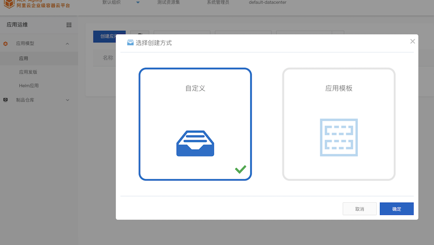
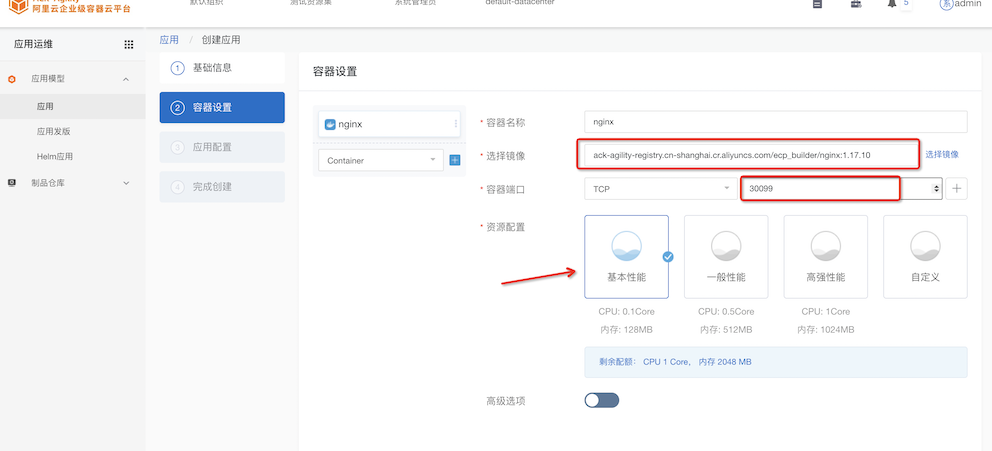

# 创建第一个应用

下图是在CNStack创建应用的简要流程

## 创建业务集群

CNStack部署后会创建名为“cluster-local”的管理集群，该集群如果有足够的工作节点可以部署应用，使用“cluster-local”部署应用的场景可以跳过本节。使用者也可以选择创建业务集群部署应用。

### 准备业务集群资源

当前平台所在集群的子网内，分配至少一个节点作为目标集群的运行环境。节点需要满足的条件和CNStack平台部署时的条件一样，master节点8C16G、50G系统盘，worker节点2C4G，50G系统盘。

#### 创建集群

进入“集群管理菜单”，可以看到“集群创建按钮”

#### 配置集群创建参数

在“Master节点配置”中，主要有以下四个配置

* 是否允许调度业务负载。作为入门验证，建议设置为允许，以减少测试资源需求。
* etcd数据盘。作为入门验证，建议设置为“与系统盘共享”，以减少磁盘需求。
* 管控数据存储。作为入门验证，建议设置为“与系统盘共享”，以减少磁盘需求。
* 本地存储池。如果第三步选择了“从本地盘调度池中划分”，需要配置用于作为本地存储池的磁盘分区。可以在目标节点使用lsblk，获取节点的磁盘分区情况。找一个合适的未使用分区填写在这里，例如，“/dev/vdb”。

#### 等待集群创建并纳管

这一步系统会自动执行，不需要用户介入

## 平台管理员创建租户，并授权资源

## 创建命名空间

进入“命名空间管理”，选择创建命名空间 - 普通命名空间

设置该命名空间的配额

成功以后结果如下

## 创建资源集

在“资源集管理”，点击创建资源集

设置资源集名称，并和管理员，命名空间绑定

成功结果如下，现在可以创建应用了：）

## 创建应用

转到“应用运维”，确保吊顶信息正确，点击“创建应用”

选择自定义

填写“应用名称”，然后下一步

填写容器名称，选择镜像选择“自定义”

镜像地址可以在本机docker images查看，或者填写其它可以获取的版本。例如：

`ack-agility-registry.cn-shanghai.cr.aliyuncs.com/ecp_builder/nginx:1.17.10`

端口选择 30099 （确保这个端口在本机没有占用），性能选择“基本性能”

应用配置处，保持默认配置即可，点击完成，即创建成功

点击“返回列表”，即可看到应用情况

然后可以参考用户手册，进行更多操作。
